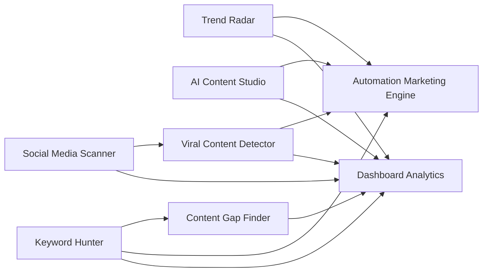

# Module Diagram - TREND RADAR AI

## Module Responsibilities
- **Dashboard Analytics**: KPI tổng quan, chart realtime, alert.
- **Keyword Hunter**: khai thác SERP suggest/related/trends + scoring.
- **Trend Radar**: phát hiện chủ đề tăng trưởng và emerging topics.
- **Social Media Scanner**: thu thập hashtag/caption/comment/engagement.
- **AI Content Studio**: sinh content đa kênh + SEO metadata.
- **Content Gap Finder**: phân tích đối thủ, so sánh missing keyword.
- **Viral Content Detector**: mô hình hóa viral/trend/engagement score.
- **Automation Engine**: orchestration pipeline và scheduling.
