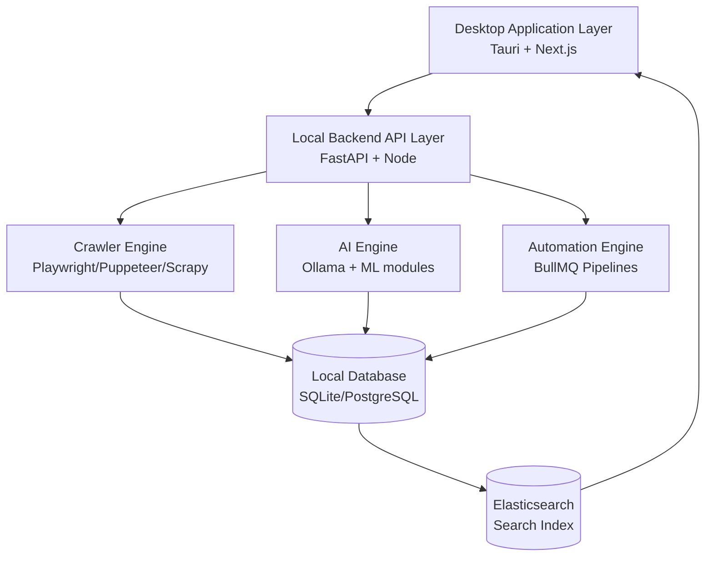

# System Architecture - TREND RADAR AI

## 1. Layers

## 2. Runtime Components
1. **Tauri launcher** bootstraps backend services and validates local dependencies.
2. **FastAPI** exposes AI/SEO/trend endpoints.
3. **Node Orchestrator** handles queue scheduling, retries, automation workflows.
4. **Crawler Workers** collect web/social/news data.
5. **AI Workers** run keyword clustering, trend scoring, viral prediction, content generation.
6. **Local DB + Elasticsearch** provide transactional storage + analytical search.

## 3. Data Flow
1. User tạo project + campaign trên desktop UI.
2. API ghi config vào DB, enqueue crawler jobs.
3. Crawler thu thập dữ liệu raw, chuẩn hóa, index vào Elasticsearch.
4. AI Engine đọc data, tính metric (difficulty/trend/viral/CPC estimate).
5. Content Studio sinh nội dung + SEO metadata.
6. Automation Engine kích hoạt lịch đăng/xuất bản/export.
7. Dashboard render realtime qua polling/websocket.

## 4. Offline-first Strategy
- Chạy local-first, không bắt buộc cloud.
- Sync adapter (optional) tách riêng để không ảnh hưởng lõi hệ thống.
- Mọi model inference ưu tiên Ollama local.
